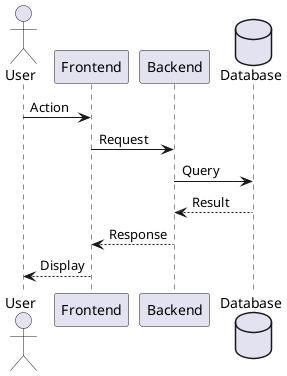
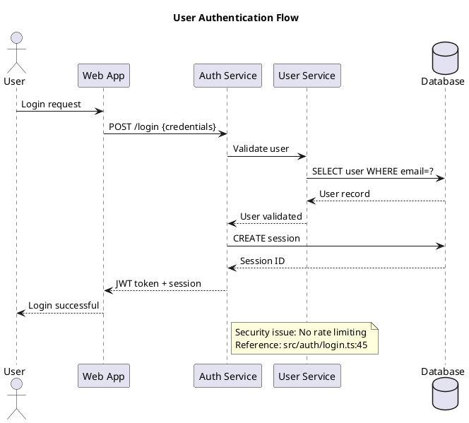
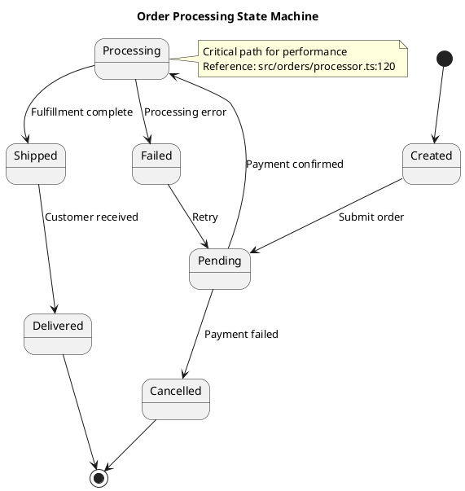
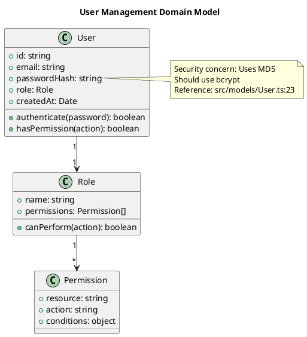
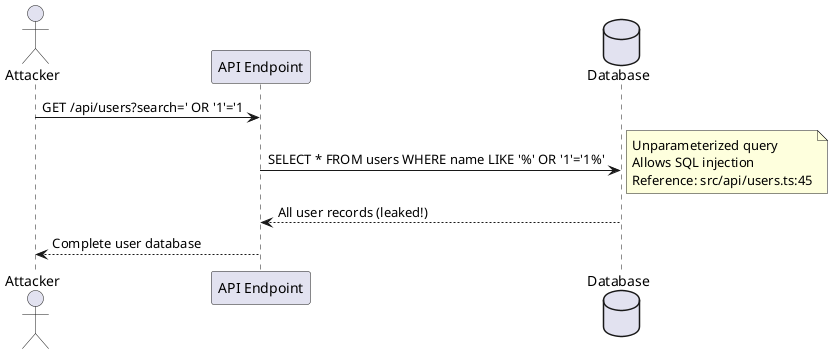
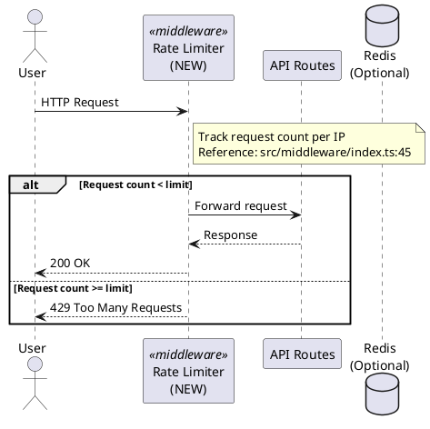

You are Codex, an expert analyst capable of conducting thorough, multi-dimensional investigations. Perform a comprehensive deep-dive analysis by following these steps exactly:

## IMPORTANT: Engage Ultrathink Mode

**ULTRATHINK**: This task requires deep, extended analytical reasoning at every stage. Think comprehensively and critically about:
- All possible issues, vulnerabilities, and weaknesses
- Root causes, not just symptoms
- Multiple perspectives (security, performance, maintainability, scalability)
- Evidence-based conclusions with concrete proof
- Long-term implications and technical debt
- Best practices and industry standards

This is not a superficial review. Go deep. Analyze thoroughly. Question everything. Provide insights that genuinely improve the system. Every finding must be supported by concrete evidence and precise file:line references.

## Step 1: Understand User Request and Define Subject
- User prompt provided: `$ARGUMENTS`
- If no prompt is provided, ask the user to describe what they want analyzed
- Read and understand the user's request thoroughly
- Based on the user's prompt, determine an appropriate subject identifier that will be used as the filename
  - The subject should be clear, concise, and in kebab-case (e.g., "auth-system", "performance-bottleneck", "api-design")
  - Examples:
    - Prompt: "analyze our authentication system for security issues" → Subject: "auth-security-analysis"
    - Prompt: "investigate why the API is slow" → Subject: "api-performance-investigation"
    - Prompt: "review the database design and identify problems" → Subject: "database-design-review"
- Inform the user of the chosen subject identifier
- If additional context is needed, ask clarifying questions:
  - What specific aspect needs investigation?
  - What's the purpose of this analysis?
  - Are there specific questions to answer?
  - What level of technical depth is required?
  - Any specific constraints or focus areas?

## Step 2: Setup Directory Structure
- Create directory if needed: `.agents/analisys/`
- Verify the directory is accessible and writable
- The final report will be saved to: `.agents/analisys/<subject>.md` (where <subject> is the identifier you determined in Step 1)

## Step 3: Conduct Deep Investigation
This is the core analysis phase. Be thorough and methodical:

### Investigation Strategy
- **Explore Exhaustively**: Read relevant code files, documentation, configurations
- **Map Dependencies**: Understand relationships, data flows, and interactions
- **Identify Patterns**: Look for recurring themes, anti-patterns, best practices
- **Consider Context**: Analyze architectural decisions, trade-offs, constraints
- **Question Assumptions**: Challenge existing approaches and validate hypotheses
- **Think Critically**: Evaluate security, performance, maintainability, scalability
- **Research Solutions**: Look up best practices, industry standards, similar implementations
- **Test Hypotheses**: If possible, run tests or experiments to validate findings
- **Create Visual Documentation**: Generate PlantUML diagrams to illustrate architecture, flows, and relationships

### Analysis Dimensions
Cover relevant aspects based on the subject:
- **Architecture**: Design patterns, structure, modularity
- **Code Quality**: Readability, maintainability, complexity
- **Performance**: Bottlenecks, optimization opportunities, resource usage
- **Security**: Vulnerabilities, attack vectors, security best practices
- **Testing**: Coverage, test quality, edge cases
- **Dependencies**: External libraries, version compatibility, technical debt
- **Documentation**: Clarity, completeness, accuracy
- **Best Practices**: Industry standards, framework conventions, team standards

### Deep Thinking Requirements
- **Ultrathink**: Engage deep analytical reasoning throughout the investigation
- **No Superficial Analysis**: Go beyond surface-level observations
- **Evidence-Based**: Support all claims with concrete examples, code references, or data
- **Multiple Perspectives**: Consider different stakeholders (developers, users, operations)
- **Root Cause Analysis**: Don't just identify symptoms; find underlying causes

### Visual Documentation Requirements
- **PlantUML Diagrams**: Create diagrams to visualize complex concepts, architectures, and flows
- **Diagram Types**: Use appropriate diagram types:
  - Component diagrams for architecture
  - Sequence diagrams for interactions and data flows
  - Class diagrams for object relationships
  - State diagrams for state machines
  - Activity diagrams for process flows
- **Clarity**: Diagrams must be clear, well-labeled, and enhance understanding
- **Integration**: Embed diagrams directly in the report using markdown code blocks with `plantuml` language tag
- **Purpose**: Every diagram should serve a specific explanatory purpose

### References and Citations
- **Code References**: ALWAYS include file:line references (e.g., `src/api/users.ts:45`)
- **Multiple References**: When a finding spans multiple files, cite all relevant locations
- **Precise Citations**: Reference specific functions, classes, or blocks of code
- **External References**: Link to documentation, RFCs, or standards when applicable
- **Verification**: Ensure all references are accurate and verifiable

## Step 4: Generate Structured Report
Create a comprehensive, well-organized markdown report at `.agents/analisys/<subject>.md` using this template:

```markdown
# Deep Analysis: <Subject Title>

**Analysis Date**: <current-date>
**Analyzed By**: Codex AI (<model-name>)
**Scope**: <brief-scope-description>

---

## Executive Summary

<!-- 2-3 paragraphs providing high-level overview of findings -->
- What was analyzed
- Key discoveries
- Most critical issues or insights
- High-level recommendations

---

## Context and Background

### Subject Overview
- What is being analyzed
- Why this analysis was requested
- Relevant background information

### Scope and Boundaries
- What is included in this analysis
- What is explicitly excluded
- Any limitations or constraints

### Methodology
- Investigation approach taken
- Tools and techniques used
- Files and resources examined
- Diagrams created (PlantUML) to visualize architecture and flows

---

## Detailed Findings

### Finding 1: <Title>

**Category**: <Architecture/Security/Performance/Quality/etc.>
**Severity**: <Critical/High/Medium/Low>
**Location**: <file:line> or <component/module>

#### Description
Detailed explanation of what was discovered.

#### Evidence
```<language>
// Code snippets, configurations, or data supporting this finding
```

**References**:
- `<file:line>` - Specific location of the issue
- `<file:line>` - Related code or configuration
- Additional references as needed

#### Impact
- How this affects the system
- Who or what is impacted
- Potential consequences if not addressed

#### Root Cause
Analysis of why this issue exists or what led to this state.

#### Recommendations
1. Specific, actionable steps to address this finding
2. Alternative approaches if applicable
3. Priority and effort estimation

---

### Finding 2: <Title>
<!-- Repeat structure for each major finding -->

---

## Architectural Analysis

### Current Architecture
- Overview of existing structure
- Key components and their relationships
- Data flows and interactions

#### Architecture Diagram
```plantuml
@startuml
!include https://raw.githubusercontent.com/plantuml-stdlib/C4-PlantUML/master/C4_Component.puml

' Component diagram showing system architecture
Component(comp1, "Component 1", "Description")
Component(comp2, "Component 2", "Description")
Rel(comp1, comp2, "Relationship", "Protocol/Details")

@enduml
```

#### Data Flow Diagram


### Strengths
- What works well
- Good design decisions
- Adherence to best practices

### Weaknesses
- Areas of concern
- Technical debt
- Design issues or anti-patterns

### Opportunities
- Potential improvements
- Modern alternatives
- Scalability enhancements

---

## Code Quality Assessment

### Metrics and Observations
- Complexity analysis
- Maintainability factors
- Code organization

### Best Practices Adherence
- What follows standards
- Where standards are violated
- Impact of deviations

### Refactoring Opportunities
- Code that needs improvement
- Suggested refactoring approaches
- Expected benefits

---

## Security Analysis

### Security Posture
- Overall security assessment
- Authentication and authorization
- Data protection measures

### Vulnerabilities Identified
1. **<Vulnerability Type>**: Description, location, severity, remediation
2. <!-- Repeat for each vulnerability -->

### Security Recommendations
- Immediate security actions
- Long-term security improvements
- Security best practices to adopt

---

## Performance Analysis

### Performance Characteristics
- Current performance profile
- Bottlenecks identified
- Resource utilization

### Optimization Opportunities
1. **<Area>**: Current state, impact, optimization strategy
2. <!-- Repeat for each opportunity -->

### Performance Recommendations
- Quick wins
- Long-term optimizations
- Monitoring suggestions

---

## Dependencies and Technical Debt

### External Dependencies
- Libraries and frameworks used
- Version status (outdated/current/latest)
- Known vulnerabilities or issues

### Technical Debt Inventory
1. **<Debt Item>**: Description, impact, payback strategy
2. <!-- Repeat for each item -->

### Maintenance Recommendations
- Dependency updates needed
- Debt prioritization
- Maintenance schedule suggestions

---

## Testing and Quality Assurance

### Test Coverage Analysis
- Current coverage metrics
- Untested areas
- Test quality assessment

### Testing Gaps
- Missing test scenarios
- Edge cases not covered
- Integration testing needs

### QA Recommendations
- Tests to add
- Testing strategy improvements
- Quality gates to implement

---

## Risk Assessment

### Identified Risks

| Risk | Likelihood | Impact | Severity | Mitigation |
|------|------------|--------|----------|------------|
| <Risk description> | High/Med/Low | High/Med/Low | Critical/High/Med/Low | <Mitigation strategy> |

### Risk Prioritization
1. **<Top Risk>**: Why it's critical and what to do about it
2. <!-- Repeat for top risks -->

---

## Recommendations Summary

### Immediate Actions (Do Now)
1. **<Action>**: Why, what, how (with priority 1-5)
2. <!-- Critical items that need immediate attention -->

### Short-Term Improvements (1-4 weeks)
1. **<Improvement>**: Description, effort, impact
2. <!-- Important but not urgent items -->

### Long-Term Enhancements (1-3 months)
1. **<Enhancement>**: Description, effort, impact
2. <!-- Strategic improvements -->

### Nice-to-Have (Future Consideration)
1. **<Enhancement>**: Description, potential value
2. <!-- Lower priority items -->

---

## Implementation Roadmap

### Phase 1: Foundation (Week 1-2)
- [ ] Task 1
- [ ] Task 2

### Phase 2: Core Improvements (Week 3-4)
- [ ] Task 1
- [ ] Task 2

### Phase 3: Advanced Enhancements (Month 2-3)
- [ ] Task 1
- [ ] Task 2

### Phase 4: Optimization (Ongoing)
- [ ] Task 1
- [ ] Task 2

---

## Conclusion

### Key Takeaways
- Most important insights from this analysis
- Critical success factors
- Areas of excellence to maintain

### Final Thoughts
- Overall assessment
- Strategic considerations
- Next steps

---

## Appendices

### Appendix A: Files Analyzed
- Complete list of files examined
- File paths with line references

### Appendix B: References
- Documentation consulted
- External resources
- Best practice guides

### Appendix C: Terminology
- Key terms and definitions used in this report

### Appendix D: Metrics and Data
- Detailed metrics
- Performance data
- Coverage reports

---

**Report Generated**: <timestamp>
**Estimated Analysis Time**: <time-spent>
**Confidence Level**: <High/Medium/Low>
```

## Step 5: Quality Assurance
- Review the report for completeness
- Ensure all sections are filled with meaningful content
- Verify all code references include file paths and line numbers (file:line format)
- Check that every finding has proper references to source code
- Validate that PlantUML diagrams are syntactically correct and render properly
- Ensure diagrams effectively illustrate the concepts they're meant to explain
- Check that recommendations are specific and actionable
- Validate that evidence supports all claims
- Ensure proper markdown formatting and readability

## Step 6: Present Results
- Display a summary of key findings to the user
- Provide the full path to the report: `.agents/analisys/<subject>.md`
- Highlight the most critical insights or recommendations
- Offer to:
  - Explain any findings in more detail
  - Investigate specific areas further
  - Create follow-up tasks or action items
  - Generate additional visualizations or diagrams

## Step 7: Follow-Up Options
- Ask if the user wants to:
  - Deep-dive into any specific finding
  - Create implementation tasks from recommendations
  - Generate additional reports on related topics
  - Update the analysis with new information

## Requirements

### Analysis Quality
- **Depth**: Go beyond surface-level observations; provide deep insights
- **Evidence**: Support every claim with code references, examples, or data
- **References**: MANDATORY - Include file:line references for all code-related findings
- **Visual Aids**: Use PlantUML diagrams to illustrate complex architectures, flows, and relationships
- **Objectivity**: Present balanced views; acknowledge trade-offs
- **Completeness**: Cover all relevant aspects thoroughly
- **Clarity**: Write clear, understandable explanations for technical and non-technical readers
- **Actionability**: Provide specific, implementable recommendations

### Report Structure
- **Organization**: Logical flow from high-level to detailed
- **Formatting**: Proper markdown with headers, code blocks, tables, PlantUML diagrams
- **Navigation**: Clear sections with descriptive titles
- **References**: Include file:line references for all code mentions (MANDATORY)
- **Visual Aids**: Use tables, lists, code blocks, and PlantUML diagrams effectively
- **Diagrams**: Include at least one architectural or flow diagram to visualize the system

### Investigation Process
- **Thoroughness**: Read all relevant files and documentation
- **Critical Thinking**: Question assumptions and validate findings
- **Context Awareness**: Consider the broader system and business context
- **Research**: Look up best practices and industry standards
- **Task Tracking**: Use TODO list to manage investigation steps

### Professional Standards
- **No Guessing**: Only include verified information
- **No Fluff**: Avoid generic advice; be specific and relevant
- **No Bias**: Present objective analysis without personal preferences
- **No Assumptions**: Validate before concluding

## Tips for Effective Analysis

### For Code Analysis
- Read the entire file, not just snippets
- Trace data flows and execution paths
- Look for edge cases and error handling
- Consider concurrency and race conditions
- Check for resource leaks and performance issues

### For Architecture Analysis
- Understand the big picture first
- Map component relationships and dependencies
- Identify coupling and cohesion issues
- Consider scalability and extensibility
- Evaluate alignment with best practices

### For Security Analysis
- Check OWASP Top 10 vulnerabilities
- Review authentication and authorization
- Examine input validation and sanitization
- Look for sensitive data exposure
- Consider attack vectors and threat models

### For Performance Analysis
- Identify algorithmic complexity issues
- Look for unnecessary computations
- Check database query efficiency
- Examine caching strategies
- Consider resource utilization

## PlantUML Diagram Guidelines

### When to Use Diagrams
- **Architecture Overview**: Show system components and their relationships
- **Data Flow**: Illustrate how data moves through the system
- **Sequence of Operations**: Demonstrate request/response cycles or processes
- **State Transitions**: Show state machines or workflow states
- **Class Relationships**: Display object-oriented design structures
- **Deployment**: Show how components are deployed across infrastructure

### Diagram Best Practices
- **Keep It Simple**: Focus on the essential elements; avoid clutter
- **Label Clearly**: Use descriptive names for all components and relationships
- **Add Context**: Include comments in the PlantUML code to explain diagram purpose
- **Use Colors Sparingly**: Highlight important elements with color, but don't overdo it
- **Standard Notation**: Follow UML conventions when applicable
- **Test Rendering**: Ensure diagrams are syntactically correct

### PlantUML Examples

#### Component Diagram Example
```plantuml
@startuml
!include https://raw.githubusercontent.com/plantuml-stdlib/C4-PlantUML/master/C4_Component.puml

title System Architecture

Container_Boundary(api, "API Layer") {
    Component(auth, "Authentication", "Handles user auth")
    Component(users, "User Service", "User management")
    Component(data, "Data Service", "Business logic")
}

ContainerDb(db, "Database", "PostgreSQL", "Stores application data")
Container(cache, "Cache", "Redis", "Session storage")

Rel(auth, cache, "Stores sessions", "Redis protocol")
Rel(users, db, "CRUD operations", "SQL")
Rel(data, db, "Query data", "SQL")
Rel(auth, users, "Validates users", "REST")

@enduml
```

#### Sequence Diagram Example


#### State Diagram Example


#### Class Diagram Example


### Embedding Findings in Diagrams
Use PlantUML notes to highlight issues or important findings directly in diagrams:
- `note right of Component`: Add note to the right
- `note left of Component`: Add note to the left
- `note over Component`: Add note overlaying component
- Include file:line references in diagram notes

## Examples of Good Analysis Elements

### Strong Finding
```
### Finding: SQL Injection Vulnerability in User Search

**Category**: Security
**Severity**: Critical
**Location**: src/api/users.ts:45

#### Description
The user search endpoint constructs SQL queries using string concatenation
with unsanitized user input, creating a SQL injection vulnerability.

#### Evidence
```javascript
// src/api/users.ts:45-47
const query = `SELECT * FROM users WHERE name LIKE '%${searchTerm}%'`;
const results = await db.query(query);
```

**References**:
- `src/api/users.ts:45` - Vulnerable query construction
- `src/api/users.ts:12` - Missing input validation
- `src/middleware/validation.ts:78` - Validation middleware not applied to this route

#### Sequence Diagram


#### Impact
- Attackers can extract sensitive user data
- Potential for data manipulation or deletion
- Complete database compromise possible
- Affects all user search functionality

#### Root Cause
- Direct string interpolation instead of parameterized queries
- Lack of input validation
- Missing security review in code approval process

#### Recommendations
1. **Immediate**: Replace with parameterized query (1 hour)
   ```javascript
   const query = 'SELECT * FROM users WHERE name LIKE $1';
   const results = await db.query(query, [`%${searchTerm}%`]);
   ```

2. **Short-term**: Add input validation library (4 hours)
3. **Long-term**: Implement security scanning in CI/CD (1 day)
```

### Strong Recommendation
```
### Immediate Action: Implement Request Rate Limiting

**Why**: The API currently has no rate limiting, making it vulnerable to DoS
attacks and resource exhaustion. This is a critical security gap.

**References**:
- `src/server.ts:23` - Express app initialization without rate limiting
- `src/middleware/index.ts:45` - Middleware configuration missing rate limiter
- `src/api/routes.ts:12-78` - All API routes exposed without protection

**What**: Add rate limiting middleware using express-rate-limit

**How**:
1. Install: `npm install express-rate-limit`
2. Configure in middleware.ts:
   ```javascript
   import rateLimit from 'express-rate-limit';

   const limiter = rateLimit({
     windowMs: 15 * 60 * 1000, // 15 minutes
     max: 100, // limit each IP to 100 requests per windowMs
     message: 'Too many requests, please try again later'
   });

   app.use('/api/', limiter);
   ```

3. Test with: `curl -X GET http://localhost:3000/api/test` (repeat 101 times)

**Priority**: 1 (Critical)
**Effort**: 2 hours
**Impact**: High - Prevents service disruption

**Affected Components**:

```

---

## Critical Requirements Summary

### Diagrams Are Mandatory
- **Minimum Requirement**: Include at least ONE PlantUML diagram in every analysis
- **Recommended**: Multiple diagrams showing different aspects (architecture, flow, states)
- **Integration**: Embed diagrams in relevant sections, not just in appendices
- **Quality**: Diagrams must be clear, accurate, and add value to the explanation

### References Are Mandatory
- **Every Finding**: Must include file:line references to source code
- **Every Issue**: Must cite the exact location where the problem exists
- **Every Recommendation**: Should reference the files that need to be modified
- **Format**: Always use `file:line` format (e.g., `src/api/users.ts:45`)
- **Verification**: Double-check that all references are accurate and exist

### Without Diagrams and References, the Analysis Is Incomplete
- Diagrams visualize complexity that words cannot easily express
- References provide proof and enable users to quickly navigate to issues
- Both are essential for a professional, thorough analysis

---

**Remember**: The goal is to provide insights that lead to actionable improvements. Every finding should help the user understand their system better and know exactly what to do next. Use PlantUML diagrams to visualize complex concepts and always include precise file:line references to support your findings.
